# G2 — Stylized 3D Browser Experiences

> **Hai thế giới 3D tương tác phong cách hoạt hình (stylized) chạy trực tiếp trên trình duyệt web.**  
> Dự án được xây dựng hoàn toàn từ số không với **Three.js**, **TypeScript**, và hệ thống engine nội bộ sinh thủ tục (**procedural engine**). Toàn bộ mô hình, cảnh quan, hiệu ứng thời tiết và âm thanh đều được tạo bằng code — **không cần tải mô hình 3D dung lượng lớn, không cần file âm thanh bên ngoài**.
>
> 🎮 **Trải nghiệm trực tiếp trên web (Live Demos):**
> - 🏯 **Himeji Castle (Trải nghiệm chính):** [https://white-heron-castle.vercel.app/](https://white-heron-castle.vercel.app/)
> - 🌍 **Keepsakeland:** [https://keepsakeland.vercel.app/](https://keepsakeland.vercel.app/)

---

## 📑 Mục lục
- [✨ Điểm nổi bật](#-điểm-nổi-bật)
- [🏯 1. Himeji Castle (Lâu Đài Himeji & Thung Lũng — Chính)](#1-himeji-castle-lâu-đài-himeji--thung-lũng--chính)
  - [Trải nghiệm & Tính năng](#trải-nghiệm--tính-năng)
  - [9 Chế độ Camera Điện ảnh](#9-chế-độ-camera-điện-ảnh)
  - [Bảng điều khiển (Himeji Castle)](#bảng-điều-khiển-himeji-castle)
- [🌍 2. Keepsakeland (Hành Tinh Kỷ Niệm)](#2-keepsakeland-hành-tinh-kỷ-niệm)
  - [Trải nghiệm & Tính năng](#trải-nghiệm--tính-năng-1)
  - [Dàn nhân vật](#dàn-nhân-vật)
  - [Bảng điều khiển (Keepsakeland)](#bảng-điều-khiển-keepsakeland)
- [⚙️ Engine Dùng Chung (`@g2/engine`)](#️-engine-dùng-chung-g2engine)
  - [Đồ hoạ Stylized & Custom Shaders](#đồ-hoạ-stylized--custom-shaders)
  - [Chu kỳ Ngày / Đêm & Thời tiết Năng động](#chu-kỳ-ngày--đêm--thời-tiết-năng-động)
  - [Âm thanh Thủ tục 100% (Procedural Web Audio)](#âm-thanh-thủ-tục-100-procedural-web-audio)
  - [Tối ưu Hiệu năng & Sinh thế giới siêu tốc](#tối-ưu-hiệu-năng--sinh-thế-giới-siêu-tốc)
- [📂 Cấu trúc Dự án (Monorepo)](#-cấu-trúc-dự-án-monorepo)
- [🚀 Hướng dẫn Cài đặt & Khởi chạy](#-hướng-dẫn-cài-đặt--khởi-chạy)
  - [Yêu cầu môi trường](#yêu-cầu-môi-trường)
  - [Khởi chạy nhanh](#khởi-chạy-nhanh)
  - [Các lệnh hữu ích khác](#các-lệnh-hữu-ích-khác)
- [⌨️ Bảng Tra Cứu Phím Tắt Nhanh (Cheat Sheet)](#️-bảng-tra-cứu-phím-tắt-nhanh-cheat-sheet)

---

## ✨ Điểm nổi bật

- 🎨 **Mỹ thuật Stylized độc đáo:** Đổ bóng cel-shading thích ứng theo độ cao mặt trời, nét viền mực (ink outline) thủ tục đung đưa nhịp nhàng theo gió, cùng hiệu ứng hạt giấy mỹ thuật (paper grain) và vignette tạo cảm giác ấm áp như những thước phim anime.
- 🍃 **Môi trường & Thời tiết biến chuyển liên tục:** Quỹ đạo mặt trời nghiêng 23° tạo nên chu kỳ ngày/đêm thực tế; gió thổi cỏ cây uốn lượn; mưa rào làm ướt mặt đất kèm sấm chớp; tuyết rơi tích tụ trên mái nhà rồi tan dần khi nắng lên; đèn lồng và cửa sổ giấy shoji tự động thắp sáng ban đêm.
- 🔊 **Âm thanh thủ tục không cần file (Zero Audio Assets):** 100% tiếng gió, mưa, sấm, sóng nước, tiếng bước chân trên từng bề mặt (cỏ, gỗ, đá, tuyết), tiếng chim hót, dế đêm, còi tàu, động cơ cano và các giai điệu đàn Koto ngẫu hứng đều được tổng hợp bằng Web Audio API theo thời gian thực.
- ⚡ **Khởi động siêu tốc & Nhẹ:** Toàn bộ thế giới được sinh bằng thuật toán (procedural generation) chỉ trong ~60ms, dung lượng tải cực nhẹ, tận dụng Web Worker và hệ thống LOD (Level of Detail) đa cấp mượt mà.

---

## 🏯 1. Himeji Castle (Lâu Đài Himeji & Thung Lũng — Chính)

> 🔗 **Chơi trực tiếp:** [https://white-heron-castle.vercel.app/](https://white-heron-castle.vercel.app/)

Đắm chìm vào thung lũng Nhật Bản truyền thống thơ mộng: lâu đài Himeji 5 tầng uy nghiêm trên đỉnh đồi đá ishigaki, bao quanh bởi rừng hoa anh đào nở rộ, những ngôi nhà mái ngói machiya cổ kính, dòng sông uốn khúc và tuyến đường sắt hơi nước chạy quanh thung lũng.

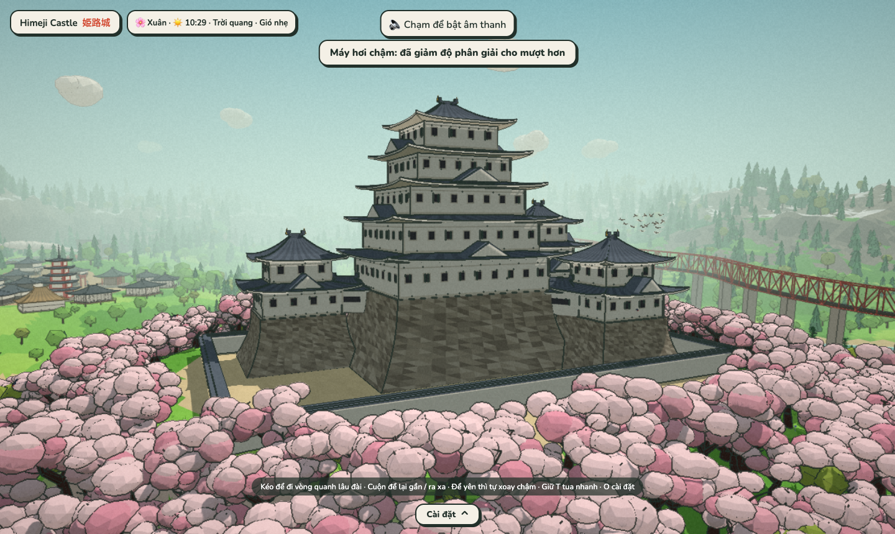

### Trải nghiệm & Tính năng
- **Lái đoàn tàu hơi nước cổ điển:** Đầu máy hơi nước nhả khói theo nhịp xình xịch, bánh đà và thanh truyền cơ khí chuyển động nhịp nhàng, kéo còi hơi vang vọng núi đồi; tự do điều khiển tăng giảm ga, phanh, chạy qua cầu thép giàn đỏ và băng qua các đường hầm xuyên núi đá.
- **Lái cano lướt sóng:** Thuyền tạo vệt sóng rẽ nước trắng xoá, nhấp nhô theo dòng nước và phản ứng chân thực khi va chạm bờ sông.
- **Hệ sinh thái tự nhiên sống động:** Đàn chim sẻ chao liệng và giật mình bay khi tàu đến gần, bướm hoa dập dờn, chuồn chuồn lướt trên mặt nước, cá chép koi nhảy tạo vòng sóng gợn trên hồ sen.
- **Đời sống làng quê:** Cư dân đi dạo trên các nẻo đường, sân ga, công viên; trò chuyện với các câu thoại song ngữ Việt – Nhật thay đổi theo thời tiết và thời gian trong ngày.

| Toàn cảnh thung lũng | Ruộng lúa & Đồi núi |
|:---:|:---:|
| 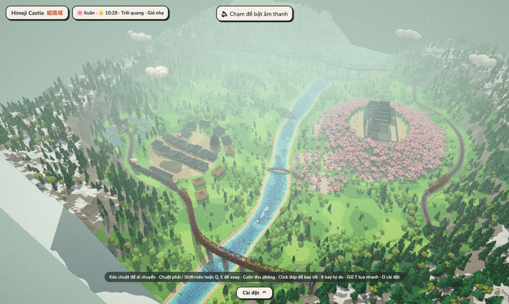 | 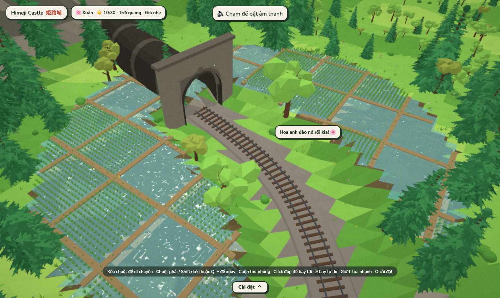 |
| **Đoàn tàu qua cầu giàn thép** | **Lái cano ven sông** |
| 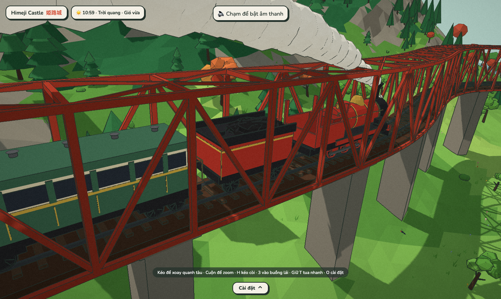 | 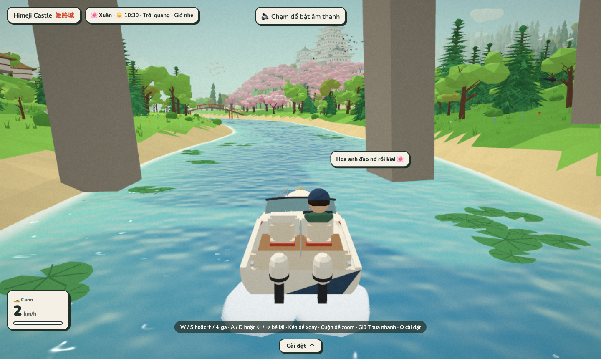 |
| **Buồng lái tàu hoả** | **Đêm trăng thanh tịnh** |
| 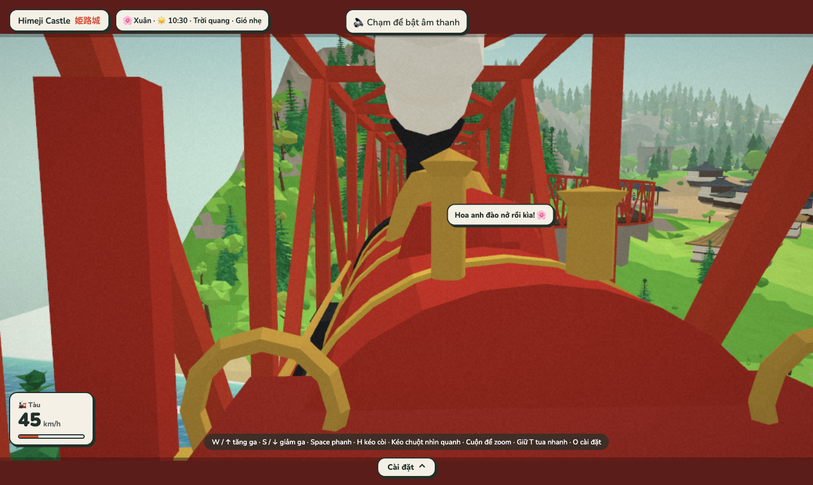 | 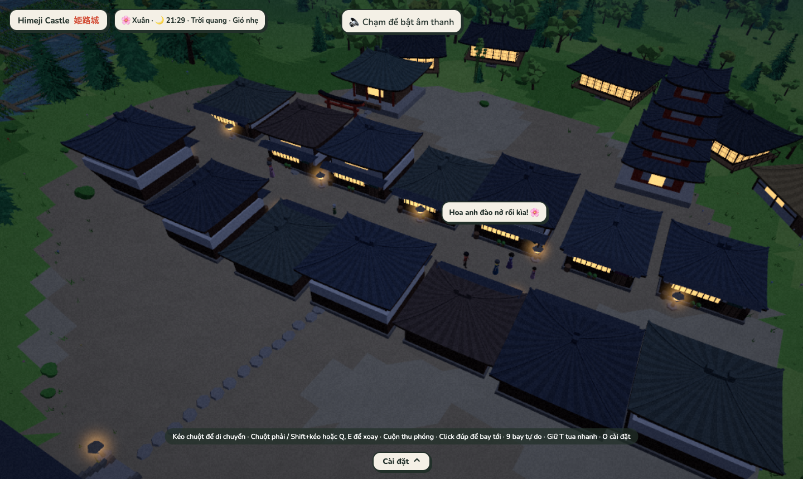 |

### 9 Chế độ Camera Điện ảnh
Nhấn các phím từ `1` đến `9` để lập tức chuyển sang các góc máy quay điện ảnh:
1. `1` — **Toàn cảnh (Overview):** Bản đồ tương tác; kéo chuột trái để dời góc nhìn, kéo chuột phải / Q, E để xoay, lăn chuột để zoom.
2. `2` — **Bám tàu (Train Chase):** Góc nhìn thứ ba theo sau đoàn tàu hoả.
3. `3` — **Buồng lái tàu (Cab / Driver):** Vào vai người lái tàu hơi nước, tự tay tăng ga và hãm phanh.
4. `4` — **Cửa sổ hành khách (Passenger):** Ngồi trong toa tàu ngắm cảnh (camera tự động chọn bên cửa sổ thoáng tầm nhìn).
5. `5` — **Góc nhìn các cây cầu (Bridges):** Ngắm tàu chạy qua các cây cầu (dùng phím `←` / `→` để đổi cầu).
6. `6` — **Bám cano (Boat Chase):** Camera theo sau cano trên sông.
7. `7` — **Ghế lái cano (Boat Driver):** Ngồi tại buồng lái cano để lướt sóng.
8. `8` — **Lượn quanh lâu đài (Castle Orbit):** Camera xoay tròn chậm rãi quanh toà lâu đài Himeji tráng lệ.
9. `9` — **Bay tự do (Free Flight):** Bay lượn tự do không giới hạn trên bầu trời thung lũng.

### Bảng điều khiển (Himeji Castle)

| Thao tác / Phím | Chức năng |
|---|---|
| `1` đến `9` | Chuyển đổi nhanh 9 chế độ camera |
| `H` | Kéo còi tàu hoả vang dội |
| `W` / `↑` và `S` / `↓` | Tăng / giảm ga tàu hoả (khi ở chế độ buồng lái `3`) hoặc ga cano (`6`, `7`) |
| `A` / `←` và `D` / `→` | Bẻ lái cano trái / phải (khi ở chế độ cano) |
| `Space` | Phanh tàu hoả khẩn cấp (khi ở buồng lái `3`) |
| `←` / `→` | Chuyển đổi qua lại giữa các cây cầu (ở chế độ xem cầu `5`) |
| `W, A, S, D` / `Mũi tên` | Bay tiến, lùi, ngang (ở chế độ bay tự do `9`) |
| `E` hoặc `Space` / `Q` hoặc `C` | Bay nâng độ cao / hạ độ cao (ở chế độ `9`) |
| `[` / `]` | Giảm / tăng tốc độ bay tự do |
| `Giữ Shift` | Tăng tốc độ bay tự do gấp 3 lần |
| `Giữ T` | Tua nhanh thời gian trong ngày (Fast forward) |
| `O` | Mở bảng Cài đặt (giờ, thời tiết, gió, tốc độ tàu, seed bản đồ...) |
| `Esc` | Đóng bảng cài đặt hoặc quay về góc nhìn Toàn cảnh (`1`) |

---

## 🌍 2. Keepsakeland (Hành Tinh Kỷ Niệm)

> 🔗 **Chơi trực tiếp:** [https://keepsakeland.vercel.app/](https://keepsakeland.vercel.app/)

Đi dạo và tự do khám phá một tiểu hành tinh hình cầu nhỏ nhắn, yên bình với hồ nước trong vắt, cánh đồng lúa bậc thang, ngôi làng cổ và ngọn núi phủ tuyết trắng.

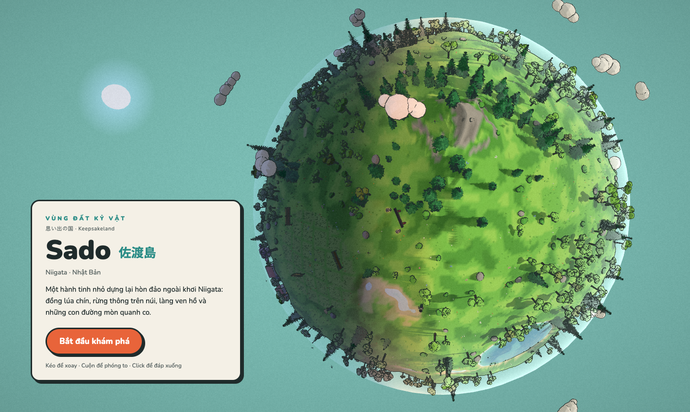

### Trải nghiệm & Tính năng
- **Trọng lực hình cầu:** Nhân vật di chuyển mượt mà trên bề mặt cong của hành tinh với trọng lực hướng tâm.
- **Tương tác phong phú:** Trò chuyện với dân làng, rung cây khiến lá bay rụng theo chiều gió, ngồi xuống ghế đá bên bờ hồ ngắm cảnh, giơ máy ảnh chụp với hiệu ứng chớp flash và âm thanh màn trập chân thực.
- **3 Góc nhìn camera linh hoạt:** Góc nhìn thứ nhất (nhìn qua mắt nhân vật), góc nhìn thứ hai (camera cố định trước mặt, điều khiển kiểu xe tăng), và góc nhìn thứ ba (sau lưng).
- **Chuyển đổi góc nhìn toàn cảnh (Overview):** Thu phóng và xoay quanh cả hành tinh lơ lửng giữa không gian với lớp khí quyển phát sáng.

| Bình minh / Dạo bước | Hoàng hôn rực rỡ |
|:---:|:---:|
| 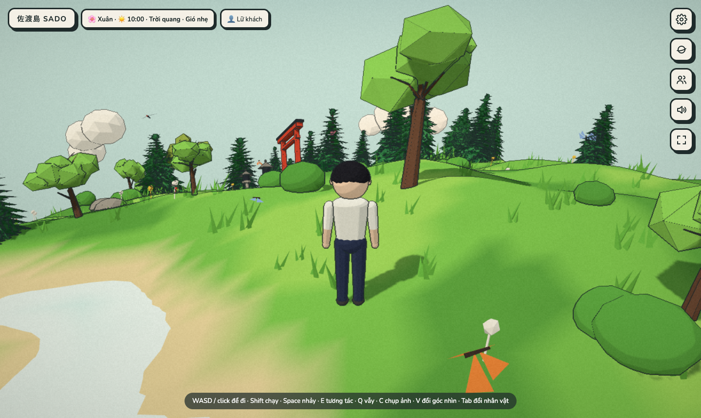 | 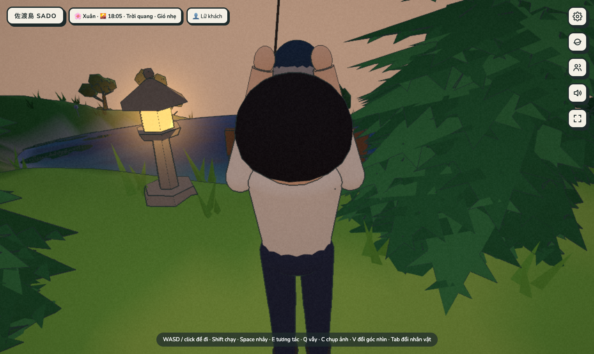 |
| **Bầu trời đêm & Ánh đèn** | **Mùa đông tuyết phủ** |
| 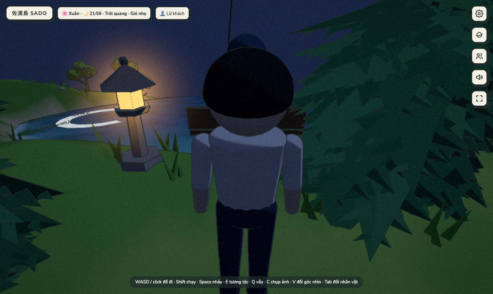 | 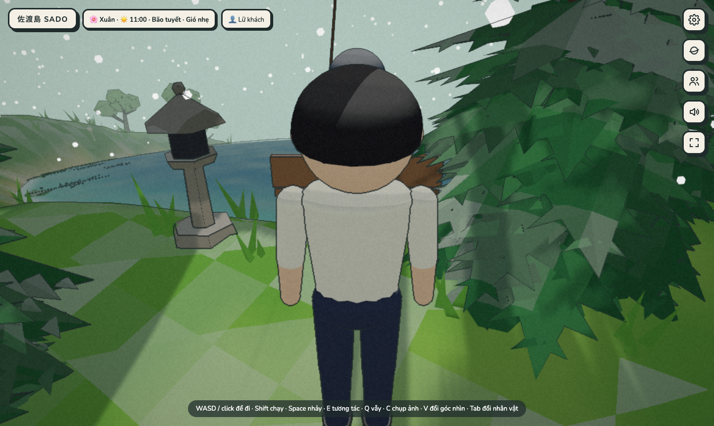 |

### Bốn mùa & điện thoại
- **Bốn mùa:** chọn Xuân / Hạ / Thu / Đông trong Cài đặt (mặc định là Xuân). Xuân hoa anh đào nở, chim bướm bay; Hạ cây xanh đậm, đom đóm và ve; Thu lá vàng đỏ rơi xuống nền đất; Đông cây rụng lá, tuyết phủ, không còn chim bướm.
- **Điện thoại:** có nút cảm ứng và cần điều khiển ảo, tự chọn độ chi tiết theo máy, tự giảm chất lượng khi máy chậm (tắt được trong Cài đặt). Thêm `?quality=low` vào URL để ép mức thấp.

### Dàn nhân vật
Bạn có thể tự do chuyển đổi để trực tiếp điều khiển bất kỳ ai trong số 5 nhân vật trên đảo (nhấn `Tab` hoặc click chọn):
1. **Lữ khách (Traveler):** Đeo máy ảnh, thích đi dạo ngắm nhìn cảnh vật.
2. **Bác nông dân (Farmer):** Đội nón rơm, chăm sóc cánh đồng lúa bên sườn đồi.
3. **Bé Hana (Kid):** Năng động, mang túi nhỏ, thích chạy nhảy và ngắm chuồn chuồn.
4. **Ông câu cá (Fisher):** Ngồi câu cá thư thái bên bờ hồ ngắm hoàng hôn.
5. **Người đưa thư (Postman):** Nón đỏ và túi thư, miệt mài rảo bước quanh các nẻo đường làng.

### Bảng điều khiển (Keepsakeland)

| Thao tác / Phím | Chức năng |
|---|---|
| `W, A, S, D` / `Phím mũi tên` | Di chuyển nhân vật (A/D xoay hướng ở góc nhìn thứ hai) |
| `Giữ Shift` | Chạy nhanh |
| `Space` | Nhảy / Đứng dậy khi đang ngồi ghế |
| `Click chuột trái` | Di chuyển tới điểm nhấp (Click-to-move) |
| `Kéo chuột` | Xoay góc nhìn camera |
| `Lăn chuột` | Thu phóng khoảng cách máy quay |
| `E` | Tương tác: Trò chuyện NPC, rung cây rụng lá, ngồi ghế |
| `C` | Chụp ảnh (kèm hiệu ứng flash và âm thanh màn trập) |
| `Q` | Vẫy tay chào |
| `Tab` | Chuyển sang điều khiển nhân vật gần nhất |
| `V` hoặc `1`, `2`, `3` | Đổi góc nhìn: Thứ nhất (`1`), Thứ hai (`2`), Thứ ba (`3`) |
| `Esc` / `M` | Chuyển đổi giữa Chế độ đi bộ và Toàn cảnh hành tinh (Overview) |
| `Giữ T` | Tua nhanh thời gian trong ngày (Fast forward) |
| `O` | Mở bảng Cài đặt (thời gian, thời tiết, gió, đồ hoạ, âm thanh) |

---

## ⚙️ Engine Dùng Chung (`@g2/engine`)

Hai dự án chia sẻ một engine nội bộ được thiết kế dạng modular tại thư mục `packages/engine`:

```
packages/engine/src/
├── render/     # Pipeline hậu kỳ: toon shader, ink outline pass, paper grain pass
├── env/        # World clock (quỹ đạo mặt trời 23°), dynamic weather, bầu trời, mưa/tuyết, lá rụng
├── audio/      # SoundScape: tổng hợp âm thanh thủ tục hoàn toàn bằng Web Audio API
├── character/  # Hoạt ảnh nhân vật thủ tục: dáng đi, nhịp thở, chớp mắt, quay đầu, trang phục
├── camera/     # Hệ thống chuyển đổi mượt mà giữa các góc máy quay (Pose transition)
├── input/      # Xử lý đa thiết bị: bàn phím, chuột, bánh lăn, cảm ứng điện thoại (virtual joystick)
├── life/       # Hệ thống đàn chim boids, bướm, chuồn chuồn, cá chép nhảy và ao sen
├── lod/        # Hệ thống Level of Detail (LOD) theo khoảng cách tối ưu hiệu năng
└── world/      # Spatial hash, raycasting, thuật toán sinh cây cỏ và công trình
```

### Đồ hoạ Stylized & Custom Shaders
- **Adaptive Cel-Shading:** Màu sắc bề mặt và độ gắt của bóng đổ được tính toán tương đối theo góc chiếu mặt trời địa phương, chuyển tiếp mượt mà qua các vùng chạng vạng sáng/tối.
- **Dynamic Ink Outline:** Lớp viền mực phong cách manga/anime được loại trừ thông minh cho các hạt mềm, đồng thời chuyển động đồng bộ theo độ lắc của cành cây trong gió.
- **Paper Texture & Water Fresnel:** Bề mặt nước có độ khúc xạ fresnel phản chiếu sắc trời, gợn sóng lấp lánh ánh kim khi có ánh nắng hoặc ánh trăng rọi vào.

### Chu kỳ Ngày / Đêm & Thời tiết Năng động
- **Hệ thống thời gian thực:** Mặt trời di chuyển theo quỹ đạo thực tế, mang lại ánh sáng vàng ấm ban trưa, sắc cam đỏ hoàng hôn và ánh xanh thăm thẳm ban đêm.
- **Thời tiết tự động chuyển biến:** Nắng nhẹ $\rightarrow$ Mây kéo đến $\rightarrow$ Mưa rào sấm chớp $\rightarrow$ Gió lốc $\rightarrow$ Tuyết rơi trắng xoá.
- **Gió toàn cục:** Trường gió vật lý tiếp tuyến lay động ngọn cỏ, ruộng lúa và cành cây; thổi bay những cánh hoa anh đào và lá rụng chao lượn trong không trung.

### Âm thanh Thủ tục 100% (Procedural Web Audio)
- Không mất băng thông tải file âm thanh, không sợ lỗi bản quyền âm thanh.
- Sử dụng các bộ dao động (Oscillator), bộ lọc (BiquadFilter), bộ tạo nhiễu trắng/hồng (Noise Generators) và envelope để tái tạo:
  - Tiếng gió hú tăng giảm theo cường độ gió.
  - Tiếng mưa rào lộp độp trên tán cây và tiếng sấm rền ngẫu nhiên.
  - Tiếng bước chân phân biệt rõ ràng khi đi trên nền cỏ êm, nền đất, sàn gỗ hay đường đá.
  - Giai điệu ngũ cung mộc mạc ngẫu hứng bằng tiếng đàn Koto Nhật Bản.

### Tối ưu Hiệu năng & Sinh thế giới siêu tốc
- **Sinh thế giới theo Seed:** Bản đồ được tính toán bằng các hàm nhiễu toán học (fBm, Voronoi) chỉ trong ~60ms, đảm bảo mỗi seed tạo ra một thế giới hoàn chỉnh, độc nhất.
- **Web Worker:** Khởi tạo lưới địa hình nặng trong luồng nền (background worker) giúp loại bỏ hiện tượng đứng hình (freeze frame) khi thay đổi độ chi tiết.
- **4 Cấu hình đồ hoạ:** `low`, `medium`, `high`, `ultra` cho phép tuỳ biến tầm nhìn xa, mật độ cây cỏ, chất lượng đổ bóng và độ mịn mặt nước để chạy mượt mà từ máy cấu hình nhẹ tới máy cao cấp.

---

## 📂 Cấu trúc Dự án (Monorepo)

```
g2/
├── apps/
│   ├── himeji-castle/      # Trải nghiệm thung lũng & lâu đài Himeji (chính)
│   │   ├── src/world/      # Sinh thung lũng, lâu đài Himeji, chùa tháp, machiya
│   │   ├── src/train/      # Vật lý đầu máy hơi nước, bám ray rayMesh, toa xe
│   │   ├── src/boat/       # Vật lý cano lướt nước và vệt rẽ sóng
│   │   └── src/cameras/    # Bộ điều phối 9 góc camera điện ảnh
│   └── keepsakeland/       # Trải nghiệm tiểu hành tinh kỷ niệm
│       ├── src/planet/     # Thuật toán tạo hình cầu và rải vật thể (scatter)
│       ├── src/player/     # Bộ điều khiển nhân vật trên mặt cầu
│       └── src/ui/         # Giao diện HUD, đồng hồ, bảng cài đặt
├── packages/
│   └── engine/             # Engine đồ hoạ, âm thanh và vật lý dùng chung
├── screenshots/            # Bộ ảnh chụp minh hoạ chất lượng cao
└── scripts/
    └── screenshots.mjs     # Script tự động hoá chụp màn hình bằng Playwright
```

---

## 🚀 Hướng dẫn Cài đặt & Khởi chạy

### Yêu cầu môi trường
- **Node.js:** Phiên bản `20.x` trở lên.
- **Trình quản lý gói:** `pnpm` (`npm i -g pnpm`).

### Khởi chạy nhanh

> **Chơi trực tuyến ngay không cần cài đặt:**  
> 🏯 [white-heron-castle.vercel.app](https://white-heron-castle.vercel.app/) *(Trải nghiệm chính)* &nbsp;|&nbsp; 🌍 [keepsakeland.vercel.app](https://keepsakeland.vercel.app/)

1. **Cài đặt dependencies:**
   ```bash
   pnpm install
   ```

2. **Chạy thử Himeji Castle (Lâu đài & Đoàn tàu — Trải nghiệm chính):**
   ```bash
   pnpm dev           # hoặc pnpm dev:himeji
   ```
   Mở trình duyệt tại địa chỉ hiển thị trên terminal (thường là `http://localhost:5174`).

3. **Chạy thử Keepsakeland (Hành tinh nhỏ):**
   ```bash
   pnpm dev:keepsake
   ```
   Mở trình duyệt tại địa chỉ hiển thị trên terminal (thường là `http://localhost:5173`).

### Các lệnh hữu ích khác

```bash
# Kiểm tra lỗi TypeScript toàn bộ monorepo
pnpm typecheck

# Chạy unit tests (Vitest)
pnpm test

# Đóng gói sản phẩm (Production build)
pnpm build

# Tự động khởi chạy server và chụp lại toàn bộ ảnh minh hoạ (yêu cầu Google Chrome)
pnpm screenshots
```

> **💡 Mẹo Debug:** Thêm tham số `?debug` vào URL khi chạy (ví dụ `http://localhost:5174/?debug`) để kích hoạt bảng điều khiển Lil-GUI, cho phép tinh chỉnh trực tiếp độ dày viền mực, cường độ ánh sáng, lực gió và các thông số shader theo thời gian thực!

---

## ⌨️ Bảng Tra Cứu Phím Tắt Nhanh (Cheat Sheet)

| Phím tắt | Himeji Castle (Chính) | Keepsakeland |
|:---:|---|---|
| `W, A, S, D` | Di chuyển góc nhìn / Lái tàu / Lái cano / Bay tự do | Di chuyển nhân vật |
| `Space` | Phanh tàu hoả / Bay nâng độ cao | Nhảy / Đứng dậy |
| `E` | Bay nâng độ cao (chế độ bay tự do) | Tương tác (nói chuyện, rung cây, ngồi ghế) |
| `Q` | Bay hạ độ cao (chế độ bay tự do) / Xoay góc nhìn | Vẫy tay chào |
| `C` | Bay hạ độ cao (chế độ bay tự do) | Chụp ảnh (kèm flash & âm thanh màn trập) |
| `H` | Kéo còi tàu hoả | — |
| `Tab` | — | Đổi sang điều khiển nhân vật khác |
| `1` – `9` | Chuyển đổi 9 góc camera điện ảnh | Đổi góc nhìn thứ 1, 2, 3 (`1`, `2`, `3`) |
| `←` / `→` | Đổi cầu ngắm tàu (khi ở chế độ Camera `5`) | — |
| `[` / `]` | Giảm / tăng tốc độ bay tự do (chế độ `9`) | — |
| `Giữ Shift` | Tăng tốc độ bay tự do gấp 3 | Chạy nhanh |
| `Giữ T` | Tua nhanh thời gian ngày/đêm | Tua nhanh thời gian ngày/đêm |
| `O` | Bật / tắt bảng Cài đặt | Bật / tắt bảng Cài đặt |
| `Esc` | Đóng menu / Chuyển sang Camera Toàn cảnh (`1`) | Đóng menu / Chuyển sang Toàn cảnh hành tinh |
| `Click / Kéo chuột` | Kéo dời bản đồ / Xoay camera / Lái hướng nhìn | Click-to-move / Xoay máy quay |
| `Lăn chuột` | Phóng to / Thu nhỏ bản đồ và góc nhìn | Thu phóng khoảng cách máy quay |
